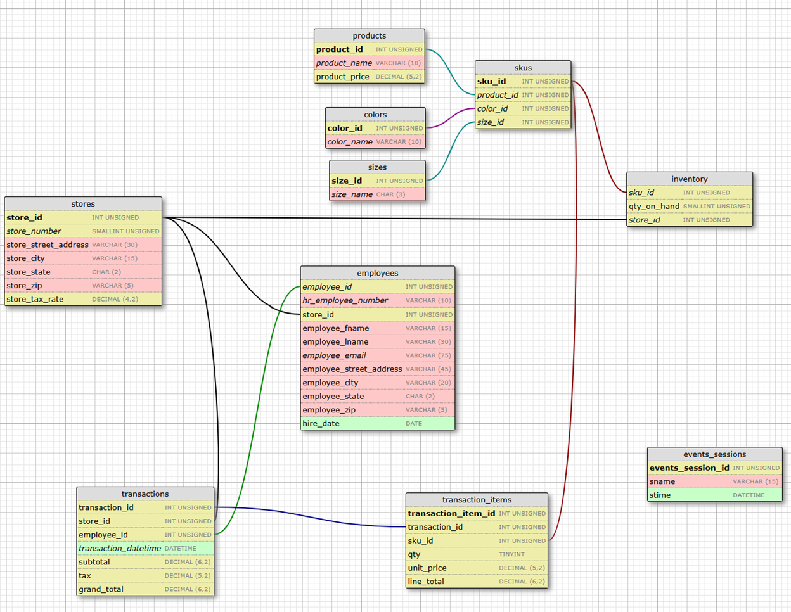

# Retail Analytics Database Project | SQL

## Overview
This project is a retail-style relational database that I designed and built using MySQL. The goal was to simulate how a business might track sales, inventory, and store performance, and then use that data to answer real business questions.

The project includes building the database structure, adding sample data, and writing queries to analyze performance and identify trends.

## Tools Used
- MySQL
- SQL (Joins, Aggregations, Stored Procedures, Triggers, Events)

## Database Design
The database models key parts of a retail business, including:
- Stores
- Employees
- Products and SKUs (with size and color variations)
- Inventory by store
- Transactions and transaction items

The structure was designed to reflect how retail data is typically organized and to support performance analysis across multiple dimensions.

## Entity Relationship Diagram (ERD)
This diagram represents the database structure, including table relationships, primary keys, and foreign keys. It was designed to support transaction tracking, inventory management, and performance analysis across stores and products.

## Key Features
- Relational database design with multiple connected tables
- Primary and foreign key relationships
- Analytical queries for business insights
- Stored procedures for reusable analysis
- Triggers to automate transaction calculations (line totals, subtotals, tax, and grand totals)
- Role-based access using users and permissions

## Example Analysis
This database supports questions such as:
- What are the top-selling products?
- How do sales vary by store?
- What is the average transaction value (ATV) by store?
- Which employees are driving the most sales?
- How do sales trends change over time?

## Key Insights
The following insights were identified using the queries included in this project:

- Top-selling products were driven by a small number of high-performing SKUs, highlighting the importance of assortment optimization
- Sales performance varied significantly by store, suggesting differences in customer traffic and demand patterns
- Average transaction value (ATV) differed across stores, indicating opportunities for targeted sales strategies
- Certain employees consistently generated higher sales, pointing to performance differences that could inform training and staffing decisions
- Sales trends over time showed variability, supporting the need for better demand forecasting and inventory planning

These findings demonstrate how a structured database can be used to support business decisions in retail operations.

## How to Use This Project

This project is organized into separate SQL files to make it easier to follow how the database is built and used.

To run the project, execute the files in the following order:

1. `tables.sql`  
   Creates all tables and relationships.

2. `inserts.sql`  
   Adds sample data to the database.

3. `views.sql`  
   Creates views used for reporting.

4. `routines.sql`  
   Includes stored procedures and functions used for analysis.

5. `event.sql`  
   Contains a scheduled event.

6. `users.sql`  
   Creates user roles and permissions.

7. `queries.sql`  
   Contains example queries used to answer business questions.

## Known Limitations and Future Enhancements

This project focuses on building a fully functioning database structure and supporting analytical queries.

### Current Limitations
- Inventory levels are not automatically updated when transactions occur.
- While transaction and line item totals are calculated using triggers, inventory is not yet tied into that workflow.

### Future Enhancements
- Add a trigger to automatically decrement inventory (`qty_on_hand`) based on transactions at the SKU and store level
- Expand inventory tracking to include low-stock alerts and replenishment logic
- Add additional reporting views and performance metrics

### Design Decision
For this project, I focused on building and validating the core functionality first, including table relationships, transaction processing, and financial calculations (line totals, subtotals, tax, and grand totals).

Automating inventory updates was identified as a next step, but was not included in the initial build in order to prioritize the primary project requirements and ensure the core system was working correctly.

## Files Included
- `tables.sql` – database schema and relationships  
- `inserts.sql` – sample data  
- `views.sql` – reporting views  
- `routines.sql` – stored procedures and functions  
- `event.sql` – scheduled event  
- `users.sql` – user roles and permissions  
- `queries.sql` – analytical queries  

## About Me
I am a data analytics candidate with a background in business, retail operations, and performance analysis. I use SQL, Excel, and Power BI to turn data into actionable insights.

## Contact
- LinkedIn: [Jenny Baum](https://www.linkedin.com/in/jenny-baum)
